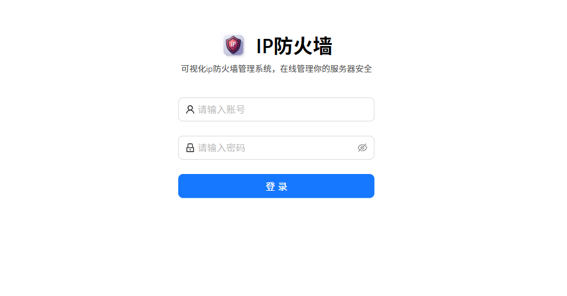
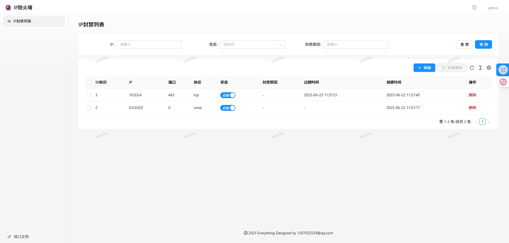

# hello_firewall

## 介绍

可视化ip防火墙管理系统，使用go语言编写相关接口，底层防火墙驱动是iptables，提供API调用

## 安装

## 安装方式一：命令行启动

- 安装依赖包

```
go mod tidy
```

- 直接启动运行
  使用go运行

```
go run main.go serve
```

- 使用gin运行（热重载）

```
gin serve run main.go
```

## 安装方式二：docker

- 新建docker-compose.yml文件

```yaml
version: "3"
services:
  hello_firewall:
    image: ghcr.io/luler/hello_firewall:latest
    privileged: true
    network_mode: host
    restart: always
    environment:
      - TZ=Asia/Shanghai  #时区
      - PORT=3000          #服务端口
      - ADMIN_NAME=admin      #管理员账号
      - ADMIN_PASSWORD=admin  #管理员登录密码
      - JWT_EXPIRE=7200 #访问token过期时间，单位秒
      - JWT_SECRET=Hw_KtnqHJ   #页面访问token加密秘钥，自定义一个复杂的
      - IPTABLES_TARGET_CHAINS=INPUT,DOCKER-USER #iptables目标链
      - DATABASE_DEFAULT_DRIVER=sqlite #数据库驱动
      - DATABASE_DEFAULT_NAME=runtime/hello_firewall.sqlite #数据库文件路径
    volumes:
      - ./runtime:/app/runtime

```

- 启动容器

```bash
docker-compose up -d
```

## 使用

- 访问地址：http://localhost:3000
  默认账号：admin，密码：admin
- 页面示例截图
  
  
